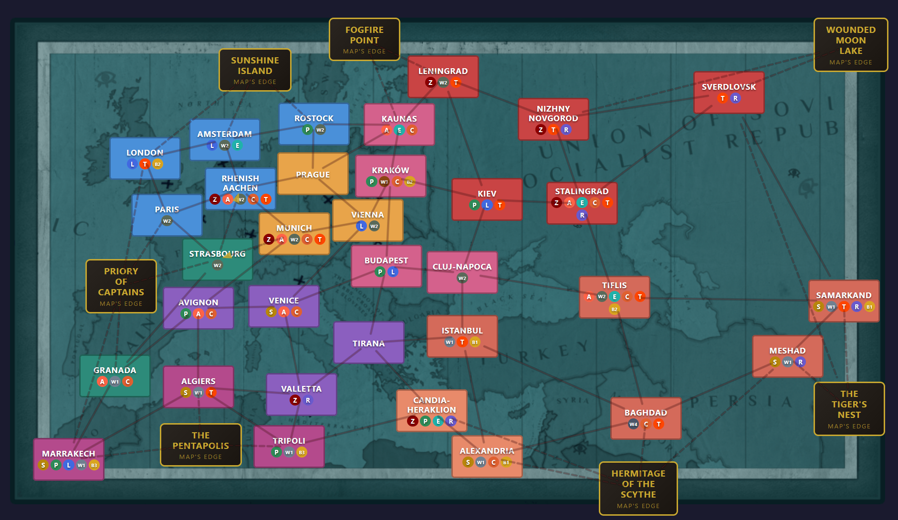
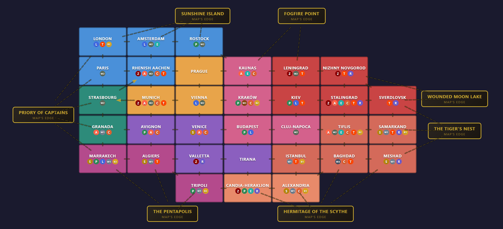
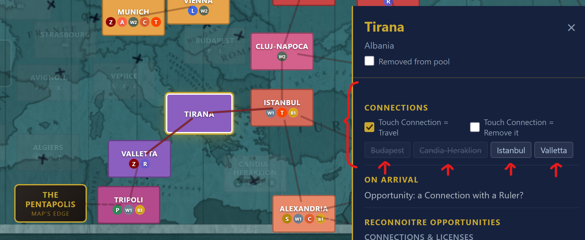
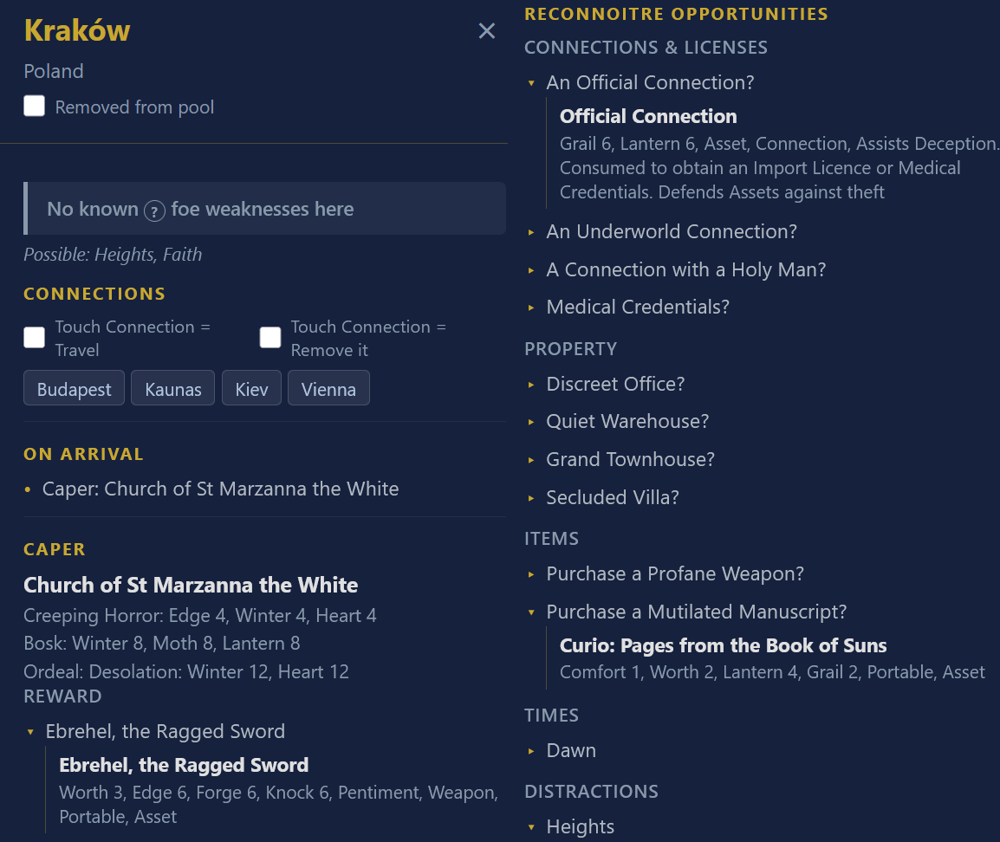
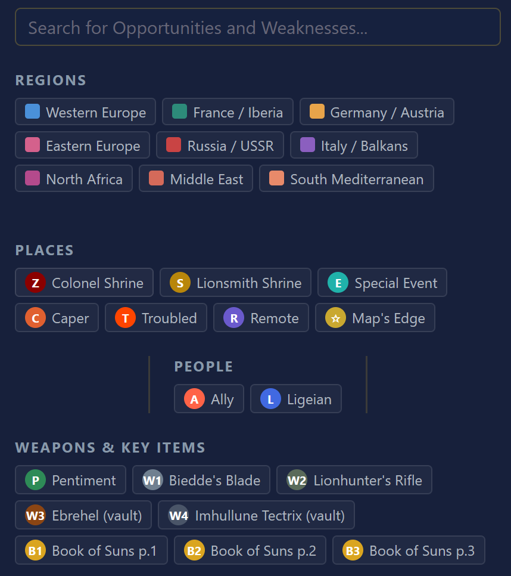
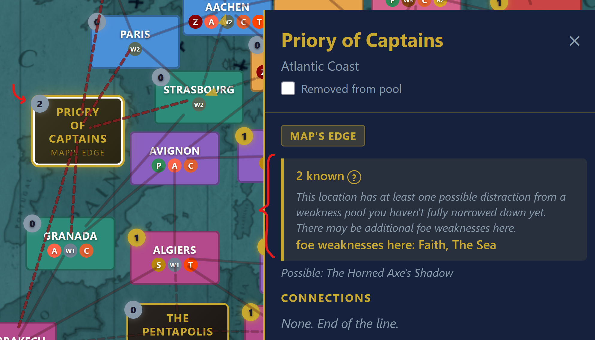
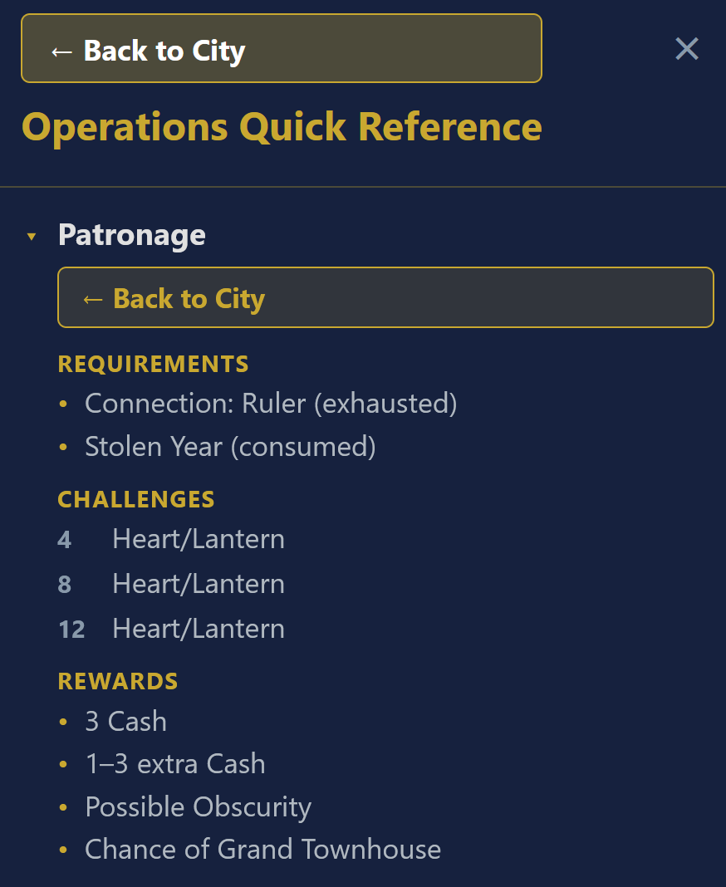
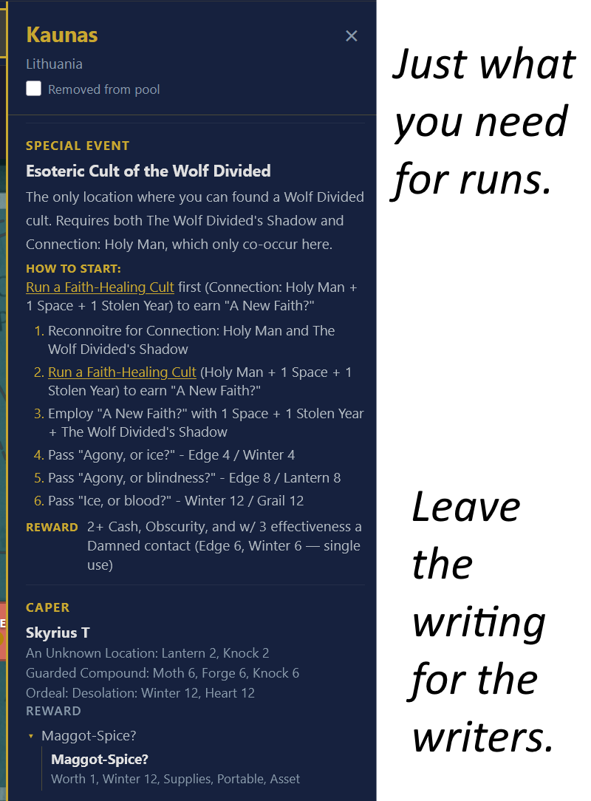

# Atlas of the Unsuspected

An interactive map explorer for Weather Factory's **Cultist Simulator: Exile** DLC.
<p align="center"><a href="https://livelycoding.github.io/atlas-of-the-unsuspected/"><strong>Try it live on GitHub Pages</strong></a></p>

<p align="center"></p>

> *"This began life as an atlas of the cities of Europe. Over decades it's been extended and annotated by a dozen hands — adepts, burglars, soldiers, spies — to show secret routes and hiding-nooks."*

> ~ Atlas of the Unsuspected, in-game item

## Disclaimers

**This is an unofficial fan project.** It is not made by, endorsed by, or affiliated with [Weather Factory](https://www.weatherfactory.biz). All game content, names, and concepts belong to Weather Factory. If you haven't played Cultist Simulator and its Exile DLC (Or Book of Hours!), go buy them, they're wonderful.

**This tool also contains major gameplay spoilers for the Exile DLC**. It is intended for players who've already started exploring and want a reference alongside their run, or speedrunners who want a tool for routing their runs, with everything they might need in one place.

**This project and data-munging for it were pretty heavily vibecoded**. I wanted this tool to exist for my own runs, so code specifics took a backseat to getting what I needed. 

That means that you should be advised that although I did run multiple automated data-rechecks, and did a by-hand pass where I hand-checked all cities for any obvious errors, be aware Exile's huge and messy; I've almost certainly missed things. There may be data inaccuracies, edge cases I missed, things that feel odd, or bugs. If you spot something wrong, please [open an issue](../../issues) and I'll get it corrected.

## What It Does

Atlas of the Unsuspected is a companion tool you keep open alongside your Exile run. It lets you:




- **Browse all locations** on either Exile's interactive geographic map, or use a compact grid view instead. Switch between either with one button press!
- **See everything at a glance** - edges quickly show connected regions, and map icons mark where you can quickly find pentiments, capers, shrines, special unique events, and all other critical landmarks that make or break a run.



- **Track your route** by marking cities as removed from your travel pool as you pass through them. The map and its edges update as you go!



- **Look up location details** - All city decks, quests, and rewards in one place. See all pentiments, connections, on-arrival events, opportunities, shrines, ligeians, allies, capers, special events, weapons, and Book of Suns pages, and needed aspects, no wiki hunts needed. Dropdowns on every opportunity let you inspect final rewards and item aspects, before you buy.



- **Search by opportunities** - find which cities offer specific reconnoitre results (connections, property, items, times, distractions). The search supports Auto-complete which makes it easy, and it supports AND logic for up to 3 terms
- **Filter by features** - highlight locations by region, shrines, troubled/remote status, allies, weapons, pentiments, and more. The OR logic used for filters can combine with auto-complete search, to allow for very granular location search!



- **Track foe weaknesses** - narrow down the 3 weakness pools (Environment, Quirks, Disfavors) as you discover them in-game. Confirmed weakness locations light up on the map with count badges. The map automatically tracks for your eliminations which cities are confirmed searched, and which still have weaknesses you could try.



- **Quick-reference operations** - Forgot what you need for Patronage operations, or running a faith healing cult? Me too. The operations quick-reference tool (and inline links to it from relevant events and connections) tell you all available operations, their requirements, challenge checks at each tier, and rewards.



- **No network hops for hard info** - Skip doing dozens of time-consuming wiki searches, and skip lore that you'd definitely enjoy reading more in-game anyways. AotU focuses exclusively on being the best tool to eliminate bean-counting or memorization, so you can actually focus on your runs.
- **Save and load run state** - export/import your removed cities, map view choice, and weakness tracker progress as a JSON file
- **Works on mobile and PC** - Don't have a second monitor? No problem, go put it on your phone.

## Getting Started

### Use it online                                                                                                                                                                                           
<p align="center"><a href="https://livelycoding.github.io/atlas-of-the-unsuspected/"><strong>Try it live on GitHub Pages</strong></a></p>

You can visit the hosted version at [GitHub Pages](https://livelycoding.github.io/atlas-of-the-unsuspected/). If needed, there is a how-to guide in the top right corner for all major subsystems. 

### Run locally

```bash
npm install
npm run dev
```

### Run with Docker

```bash
docker compose up -d --build
```

## Tech Stack

- **React 18** with TypeScript
- **Vite** for builds
- **CSS Modules** for scoped styling

## Data Accuracy

Location data, opportunities, operations, special events, and anything in the data I thought looked weird was cross-referenced against [Frangiclave](https://uadaf.theevilroot.xyz/frangiclave/), the [Cultist Simulator Wiki](https://cultistsimulator.fandom.com/) and in-game testing. If you find an error, please [open an issue](../../issues).

## License

This is a fan project. Game content belongs to Weather Factory. The code in this repository is available under the [MIT License](LICENSE).
